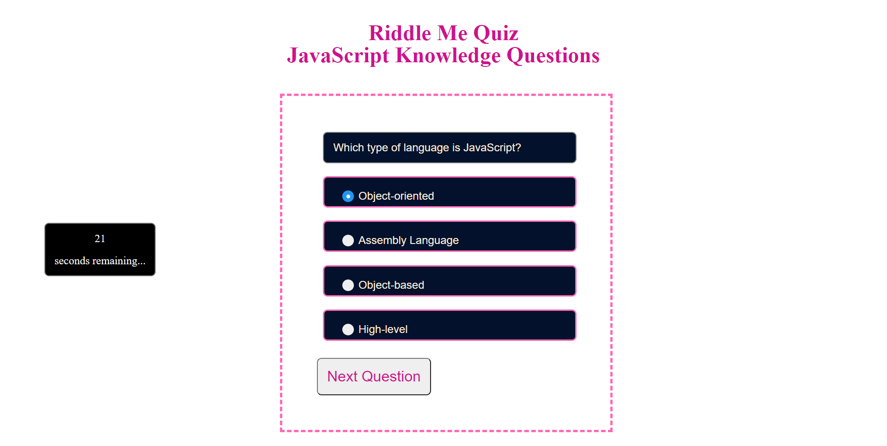

# Riddle Me Quiz - JavaScript Knowledge Questions

## Description

This is a mini-quiz that tests the taker's knowledge on the theoritical aspects of JavaScript. Once the quiz is finished, it lets the test taker save their initials and score in order to gauge their progress with the language.

### Usage

You will be able to start the quiz by simply clicking the 'Start Quiz' button on the main page. Once you finish answering the question, click submit. The questions are timed so be sure you answer in time.

## Link to the Deployed Application

[Riddle Me Quiz](https://forester93.github.io/riddle-me-quiz/)

## Link to the Github Repository

[Riddle Me Quiz Github Repo](https://github.com/Forester93/riddle-me-quiz/)

## Screenshot of the Application

## Contact me

| Name          | Email                    | Phone Numer         |
| ------------- | ------------------------ | ------------------- |
| Mark Forester | markforester93@gmail.com | +61 (0) 404-831-362 |

## Commits for this Application

### First Commit

• Created the markdown file.

### Second Commit

• Basic wireframe of the application in HTML.
• Basic Styling of the application in CSS.
• Updating README.md
• Adding the question bank in the script.js file.

### Third Commit

• Added basic functionality to the JavaScript file. (Next Question, show and hide buttons, import questions from question bank)
• Linked the radio buttons together.
• Enhanced the display of some of the elements.
• Added comments to the css file.

### Fourth Commit

• Added grading functionality to the code.
• Added saving scores functionality to the code.
• Added retrieving scores functionality to the code.
• Added reset score functionality to the code.
• Added screenshot of the assets.
